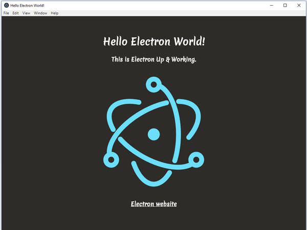

# Hello Electron
hello-electron is a simple Electron Hello World App dressed up a little to see how Electron works

Electron website URL [https://electronjs.org](https://electronjs.org)

#### Requirements 

This app does need to have installed node.js and npm 
[Download node.js with npm](https://nodejs.org)

#### Install Electron
---
To install the latest version of Electron using npm:	

	npm i -D electron@latest

#### Steps to get up and going
---
1. create your directory
2. cd into project directory
3. run npm init
4. run npm install electron --save-dev --verbose
5. code application
6. add to package.json, replace "test" line of code with  "start": "electron ."
7. run npm start
8. script should now run.

